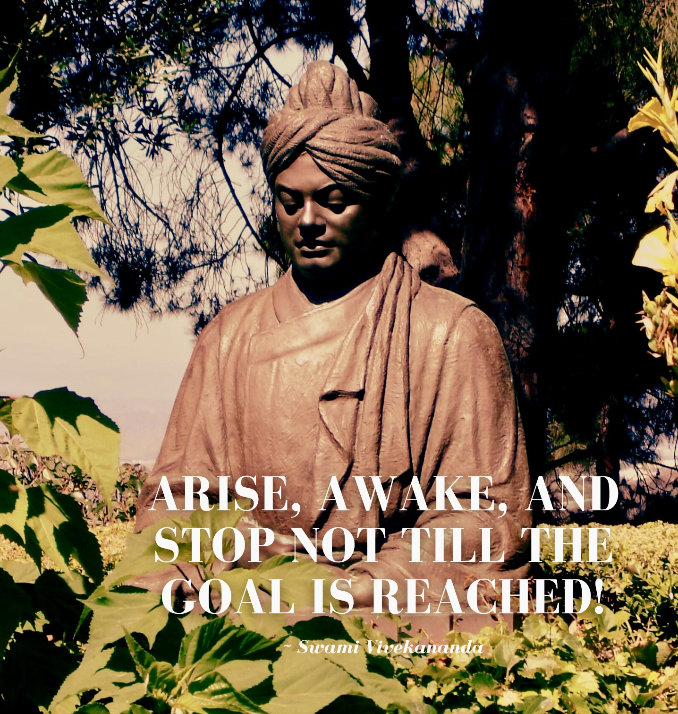

## Lost?

At some point or another, we all usually are. Try going back <a href="/index.html">home</a>.

<iframe src="https://giphy.com/embed/xULW8vi25RrpxQrmrm" width="480" height="270" frameBorder="0" class="giphy-embed" allowFullScreen></iframe>
<a href="https://giphy.com/gifs/detourtbs-funny-comedy-xULW8vi25RrpxQrmrm">via GIPHY</a>

<!-- <h1>Lost?</h1>

We all usually are. Here's an inspiring quote from <a href="https://en.wikipedia.org/wiki/Swami_Vivekananda">Swami Vivekananda</a>:

<em>"Arise, awake and stop not til the goal is reached!"</em>

Go back <a href="/index.html">home</a> or if you found that interesting, here is the quote he referenced when saying it: the Katha Upanishad, a tale about a young boy, Nachiketa, who goes to the Yama, the Lord of Death himself to know the nature of humanity, knowledge, self and liberation.

<em>Uttisthata Jagrata Prapya Varannibodhata</em>

<em>Kshurasanna Dhara Nishita Durataya </em>

<em>durgama Pathah tat kavayo Vadanti</em>

whose English translation is:

<em>Arise! Awake! Approach the great and learn.</em>
 
    
<em></em>Like the sharp edge of a razor is that path,</em>

        
<em>so the wise say—hard to tread and difficult to cross.</em>
 -->
    
    